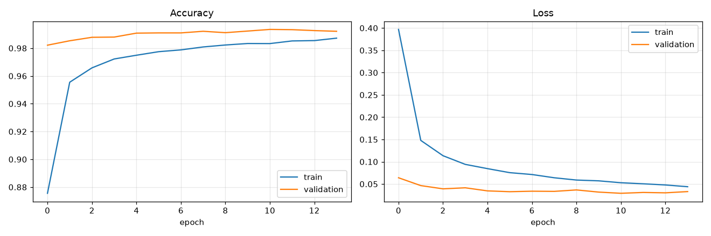
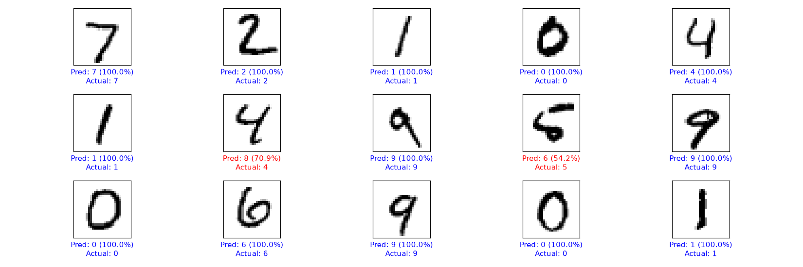
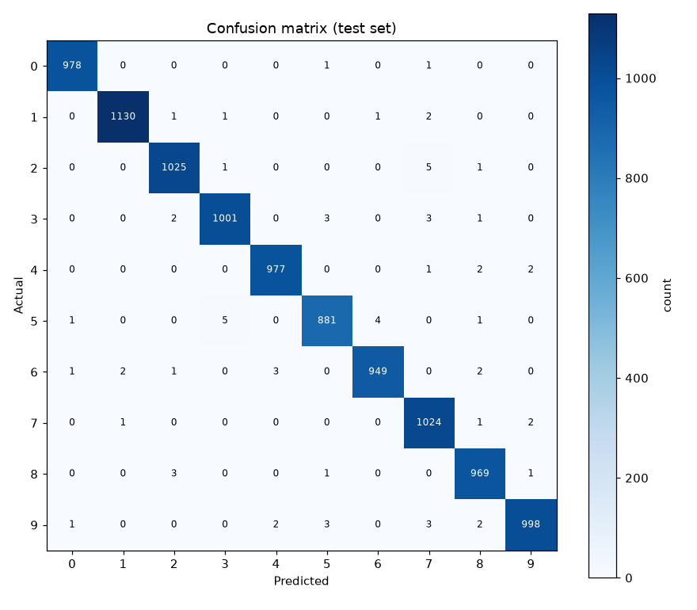

# MNIST Handwritten Digit Recognition

A convolutional neural network that recognizes handwritten digits (0–9), built with TensorFlow/Keras. It trains to **99.3% test accuracy** on the MNIST dataset and can classify digit images you supply yourself.

This repo is meant to be readable. If you're learning how a real image-classification project fits together — training, evaluation, and inference as separate steps, with a saved model in between — the code and this writeup walk through the *why* behind each decision, not just the *what*.

---

## What it does

The project is split into three scripts, each with one job:

| Script | Job | Run it |
|--------|-----|--------|
| `train.py` | Builds the CNN, trains it once, saves the model to disk | Once |
| `evaluate.py` | Loads the saved model and produces the result visuals | Anytime |
| `predict.py` | Loads the saved model and classifies a single image you give it | Anytime |

The key idea: **training happens once.** The trained model is saved to `saved_model/mnist_cnn.keras`, and everything afterward just loads it. You don't retrain to make a prediction — you train once, then reuse. This is how real ML projects are structured, and it's the difference between a throwaway script and something usable.

---

## Quick start

```bash
# 1. set up an isolated environment (recommended)
python -m venv .venv
.\.venv\Scripts\Activate.ps1        # Windows PowerShell
# source .venv/bin/activate          # macOS / Linux

# 2. install dependencies
pip install -r requirements.txt

# 3. train the model (one time, ~3 minutes on CPU)
python train.py

# 4. generate the result visuals + sample test images
python evaluate.py

# 5. classify a digit
python predict.py samples/sample_7.png
```

Running `evaluate.py` drops a few real MNIST digits into `samples/` automatically, so `predict.py` has something to run on immediately — no need to find or draw an image first.

---

## Results

The model reaches **99.32% accuracy on the 10,000-image test set** — it gets 9,932 right and 68 wrong. Here's what that looks like in detail.

### Training history



Two things to read here:

- **Both curves climb/fall smoothly and then flatten** — that's healthy training. Accuracy rises fast in the first couple of epochs, then the gains shrink as the model approaches its ceiling.
- **Validation accuracy (orange) sits *above* training accuracy (blue)** — which looks backwards at first. It's actually the signature of the data augmentation (explained below): the model trains on deliberately distorted images but is validated on clean ones, so it scores higher on the easier validation set. A model that *wasn't* augmented would show the opposite — training accuracy pulling ahead as it memorizes the training set.

Training stopped automatically at epoch 14 (not the full 15) because validation accuracy peaked at epoch 11 and didn't improve for three rounds. The best weights were restored, so the saved model is the epoch-11 version, not the last one.

### Predictions on test images



Fifteen test digits with the model's prediction and the true label. Blue means correct, red means wrong. Thirteen of fifteen are right — and the two misses are instructive:

- A **4 misread as 8** (70.9% confidence) — the digit is drawn with a closed top loop that genuinely resembles an 8.
- A **5 misread as 6** (54.2% confidence) — a cramped, looping 5. Note the low confidence: the model is openly unsure, which is the correct behavior on an ambiguous input. A well-calibrated model should hesitate on genuinely hard cases rather than guess wrong with false certainty.

### Confusion matrix



This is the most useful diagnostic in the project. Each cell `(row, column)` counts how many times a digit of the *actual* class (row) was *predicted* as the column class. The bright diagonal is correct predictions; any bright off-diagonal cell is a systematic mistake.

What it reveals about this model:

- **The diagonal dominates** — nearly every prediction is correct, which is the 99.3% accuracy shown visually.
- **Digits 5 and 9 are the hardest** — 11 errors each, more than any other digit.
- **The most common single confusion is 5 → 3** (5 times), followed by **2 → 7** (5 times). These are visually plausible: a 5 with a straightened top can look like a 3, and a 2 with a small loop can resemble a 7.
- **Digit 0 is the easiest** — only 2 errors out of 980. Its round shape rarely overlaps with other digits.

A confusion matrix is worth more than a single accuracy number because it tells you *where* a model fails. If you wanted to improve this model further, it points you straight at the 5s and 9s.

---

## How the model works

The network is a small **convolutional neural network (CNN)**. Here's the architecture and the reasoning:

```
Input (28×28 grayscale)
  → Data augmentation (random rotation + zoom)   ← only active during training
  → Conv2D (32 filters) → MaxPooling
  → Conv2D (64 filters) → MaxPooling
  → Flatten
  → Dense (128) → Dropout (50%)
  → Dense (10, softmax)                          ← outputs probability per digit
```

**Why a CNN instead of a plain dense network?** MNIST images are 2D, and the position of strokes relative to each other is what defines a digit. A plain dense network flattens the image into a 1D row of pixels immediately, throwing that spatial structure away. Convolutional layers instead slide small filters across the image, learning to detect edges, curves, and loops *wherever they appear*. For image tasks this is a large advantage — it's the difference between roughly 97.8% (dense) and 99.3% (CNN) here.

**Why data augmentation?** During training, each image is randomly rotated and zoomed a little, so the model never sees the exact same image twice. This forces it to learn the *general shape* of each digit rather than memorizing pixel-exact training examples. The payoff is twofold: slightly better test accuracy, and — more importantly — much better performance on digits *you* draw, which are never as clean or centered as MNIST. The augmentation is automatically disabled at evaluation and prediction time.

**Why dropout?** The `Dropout(0.5)` layer randomly ignores half the neurons on each training step. This is a regularization technique that prevents the model from over-relying on any single pathway, which reduces overfitting (the model memorizing the training set instead of learning to generalize).

---

## Classifying your own digits

`predict.py` takes any image of a single digit and classifies it:

```bash
python predict.py path/to/your_digit.png
```

It prints the predicted digit, its confidence, and the top-3 guesses:

```
Predicted: 7  (100.0% confident)

Top 3:
  1. digit 7 -> 100.0%
  2. digit 9 -> 0.0%
  3. digit 2 -> 0.0%
```

To test with your own handwriting, draw a single digit in any image editor — **thick dark strokes on a white background, roughly centered** — and save it as a PNG. The script handles the rest: it converts to grayscale, inverts the colors to match MNIST's white-on-black format, and resizes to 28×28.

**A realistic expectation:** a model trained only on MNIST can still stumble on hand-drawn digits, because real handwriting varies far more than the dataset — stroke thickness, slant, and centering all differ. The data augmentation helps, but if a particular digit predicts wrong, that's the well-known "MNIST-to-real-world gap," not a bug. The fix would be training on more varied data.

---

## Notes on performance

Training runs on CPU (TensorFlow dropped native-Windows GPU support as of 2.11). For MNIST this is fine — training takes about 3 minutes. A few choices in `train.py` keep it fast and keep the machine from overheating during that sustained load:

- **CPU thread limiting** caps how many cores TensorFlow uses, leaving cooling headroom. Adjust `NUM_THREADS` at the top of `train.py` — lower it if the machine runs hot, raise it (or remove the cap) if you have good cooling and want maximum speed.
- **Early stopping** ends training once accuracy plateaus instead of always running every epoch.
- **A deliberately small model** — one convolution per block — since MNIST doesn't need a large network to hit 99%.

After the one-time training, `evaluate.py` and `predict.py` are lightweight (seconds, not minutes) because they only load the saved model.

---

## Project structure

```
neural-net-mnist/
├── train.py               # build + train + save the model
├── evaluate.py            # generate result visuals + sample images
├── predict.py             # classify a single image
├── requirements.txt       # dependencies
├── saved_model/           # the trained model (created by train.py)
├── samples/               # test digit images (populated by evaluate.py)
├── docs/                  # the result images shown in this README
└── README.md
```

---

## Requirements

- Python 3.10+
- TensorFlow, NumPy, matplotlib, Pillow (see `requirements.txt`)

---

## What you can learn from this repo

If you're studying it, here are the transferable ideas — none of them specific to MNIST:

1. **Separate training from inference.** Train once, save the model, load it everywhere else. This is the single most important structural habit in applied ML.
2. **A CNN beats a dense network on images** because it preserves spatial structure instead of flattening it away.
3. **Data augmentation buys generalization** — distorting training data teaches the model the underlying shape rather than the exact pixels.
4. **The confusion matrix tells you *where* a model fails,** which a single accuracy number can't. It's the first place to look when you want to improve.
5. **Confidence matters as much as the prediction.** A good model is unsure on genuinely ambiguous inputs rather than confidently wrong.