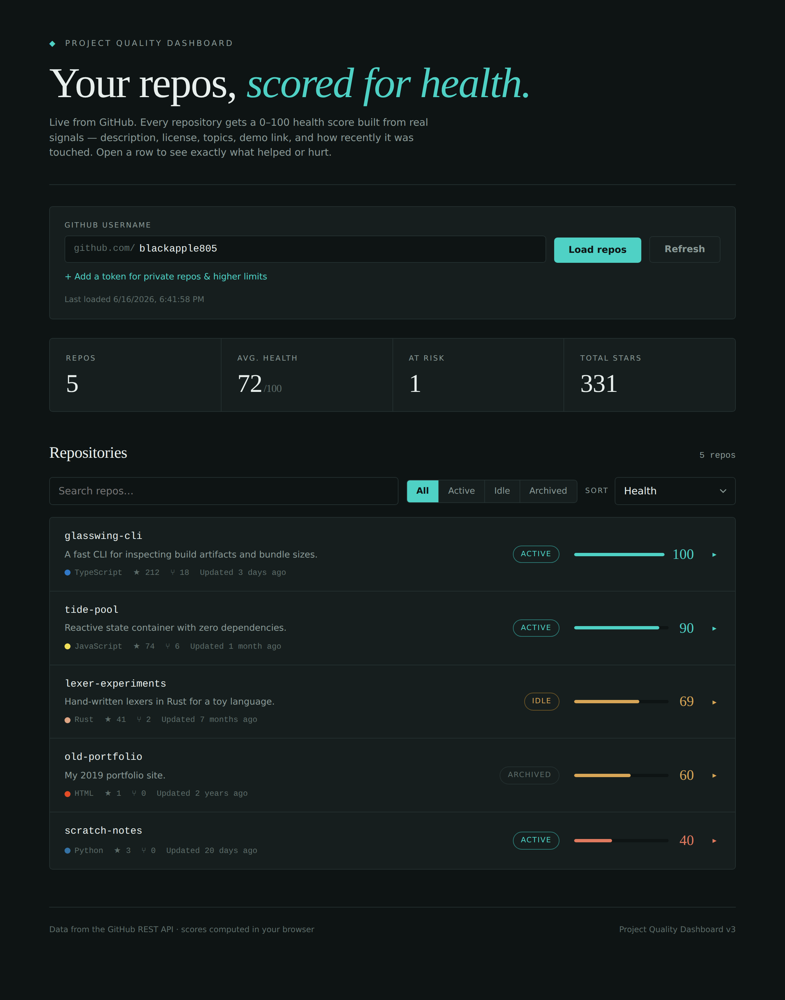
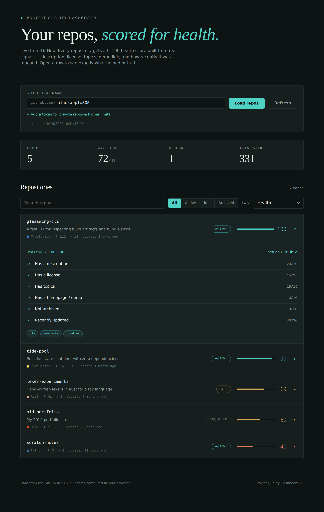

# Project Quality Dashboard

A live dashboard that pulls your **actual GitHub repositories** and gives each
one a 0–100 **health score** computed from real metadata — not a demo, and not
a number you type in by hand.

Open any repo to see exactly what helped or hurt its score, with concrete tips
for the things it's missing.

Everything runs in the browser. There's no backend and no database — the only
input is a GitHub username.

## What it looks like

The dashboard: a summary rail up top, then every repo with its language, stars,
last update, and computed health score.



Open any repo to see how its score was built — each factor, the points it
earned, and a tip for anything it's missing.



> The images above use example repositories. Run the app against your own
> account and the screenshots regenerate from your real data — see
> [Regenerating the screenshots](#regenerating-the-screenshots).

## What the score measures

Each repo is scored out of 100 from signals in the GitHub API:

| Factor                  | Points | Why it matters                          |
| ----------------------- | -----: | --------------------------------------- |
| Has a description       |     20 | People can tell what it is at a glance  |
| Has a license           |     15 | Others know how they can use it         |
| Has topics              |     15 | Discoverable on GitHub                  |
| Has a homepage / demo   |     10 | There's somewhere to see it live        |
| Not archived            |     10 | Reads as maintained, not abandoned      |
| Recently updated        |     30 | Full marks <= 90 days, sliding to 0 by ~2 years |

The math lives in `src/lib/github.js` (`computeHealth`). Tune the weights there
if your idea of "healthy" differs — the breakdown UI updates automatically.

## Run it

```bash
npm install
npm run dev
```

Opens at http://localhost:3000. It loads `blackapple805` by default; change the
username in the bar at the top to load anyone's public repos.

## Private repos & rate limits

Unauthenticated requests are capped at 60/hour per IP — fine for personal use.
To include **private repos** and lift the limit to 5,000/hour, click
*"Add a token"* and paste a GitHub personal access token with read access.

The token is kept in this browser's `localStorage` only; it's never sent
anywhere except GitHub.

## Build & deploy

```bash
npm run build      # static files in dist/
npm run preview    # check the build locally
```

`dist/` is plain static output — host it on GitHub Pages, Netlify, Vercel, or
any static host.

## Regenerating the screenshots

The README images live in `docs/` and are captured by a small script, so they
can always reflect your real repos and the current design.

```bash
npm install -D playwright        # one-time
npx playwright install chromium  # one-time

npm run dev                      # in one terminal
npm run screenshot               # in another — writes docs/dashboard.png + docs/health-breakdown.png
```

Commit the updated images and the README will show them. Point the script at a
different URL with `APP_URL=http://localhost:4173 npm run screenshot`.

## How it's put together

```
src/
  main.jsx                 React entry
  App.jsx                  Owns settings, fetch, filter/sort, and view state
  styles.css               Design system + all component styles
  components/
    ConnectBar.jsx         GitHub username + optional token
    SummaryRail.jsx        Repos / avg health / at-risk / total stars
    Controls.jsx           Search, state filter, sort
    RepoRow.jsx            One repo + its expandable health breakdown
  lib/
    github.js              Fetches repos and computes the health score
    score.js               Color, label, relative time, language colors
    storage.js             Remembers your username/token + caches the last load
scripts/
  screenshot.mjs           Captures the README images from a running instance
docs/
  dashboard.png            README screenshot — overview
  health-breakdown.png     README screenshot — expanded health breakdown
```

## Notes

- A reload shows your last results instantly from cache, then refreshes in the
  background.
- The score uses only the repo listing payload, so a full account loads in a
  single API request.
